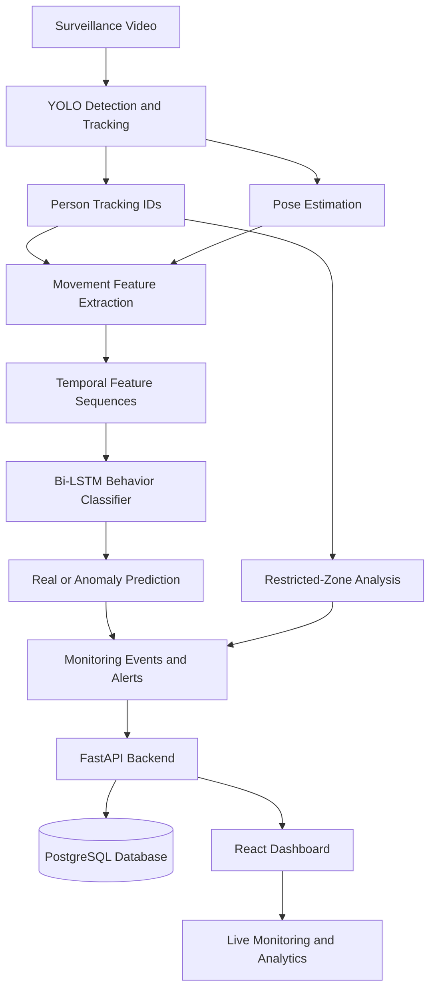

# Sentinel — AI-Powered Surveillance & Behavioral Intelligence System

Sentinel is an AI-powered video surveillance system designed to detect people, track their movements, analyze temporal behavioral patterns, and flag potential anomalies in surveillance footage. It combines computer vision, deep learning, and real-time monitoring to transform conventional video surveillance into an intelligent monitoring platform.

The system integrates YOLO-based object detection and tracking, pose estimation, a Bi-LSTM behavior classifier, restricted-zone monitoring, and a web-based dashboard for visualizing detections and alerts.

> **Project status:** Working prototype. Anomaly predictions are indicators for human review, not proof of theft or criminal intent.

---

## Key Features

- **Person Detection:** Detects people in video footage using YOLO.
- **Object Tracking:** Maintains track IDs to follow detected people across frames.
- **Pose Estimation:** Extracts body keypoints to analyze movement and posture.
- **Behavior Classification:** Uses a Bidirectional LSTM (Bi-LSTM) to classify temporal movement features as Real or Anomaly.
- **Restricted-Zone Monitoring:** Identifies people entering configured restricted areas.
- **Anomaly Alerts:** Flags potentially unusual behavior for further inspection.
- **Live Monitoring Dashboard:** Displays detections, behavior assessments, zone warnings, and anomaly information.
- **Video Upload and Analysis:** Allows users to upload videos for processing through the monitoring pipeline.
- **Analytics Dashboard:** Summarizes classification counts and monitoring results.
- **Backend API:** Uses FastAPI to connect video-processing components with the frontend.
- **Database Integration:** Uses PostgreSQL to persist structured monitoring data.

---

## System Architecture



### Processing Pipeline

1. Video frames are read and processed using computer vision.
2. YOLO detects objects and tracks people across frames.
3. Pose estimation extracts body keypoints.
4. Movement-related features are calculated and arranged into temporal sequences.
5. The Bi-LSTM classifies sequences into Real or Anomaly.
6. Restricted-zone rules generate zone warnings independently of the classifier.
7. The backend makes monitoring information available to the dashboard.
8. The frontend displays detections, alerts, and analytics.

---

## Machine Learning Model

Sentinel uses a **Bidirectional Long Short-Term Memory (Bi-LSTM)** neural network implemented with PyTorch.

Unlike a classifier that considers only a single frame, the Bi-LSTM processes sequences of movement features to learn temporal patterns.

### Model Configuration

| Parameter | Value |
|---|---|
| Architecture | Bidirectional LSTM |
| Framework | PyTorch |
| Input features | 13 per time step |
| Sequence length | 30 frames |
| Output classes | 2 |
| Class 0 | Real |
| Class 1 | Anomaly |
| Epochs | 40 |
| Batch size | 16 |
| Optimizer | Adam |
| Learning rate | 0.001 |
| Loss function | Weighted Cross-Entropy Loss |
| Training device | CPU |

### Handling Class Imbalance

The prototype dataset contains substantially more Real examples than Anomaly examples. To reduce the tendency to favor the majority class, the training pipeline uses weighted Cross-Entropy Loss.

The class weights are calculated from the training-set distribution, assigning a higher penalty to errors involving the underrepresented Anomaly class.

### Validation Results

The following results were recorded during a 40-epoch training run. The checkpoint was selected based on the best observed validation Anomaly F1-score.

| Metric | Validation Score |
|---|---:|
| Accuracy | **94.74%** |
| Anomaly Precision | **66.67%** |
| Anomaly Recall | **100.00%** |
| Anomaly F1-score | **80.00%** |

### Dataset Distribution

| Split | Real | Anomaly | Total |
|---|---:|---:|---:|
| Training | 132 | 18 | 150 |
| Validation | 34 | 4 | 38 |
| **Total** | **166** | **22** | **188** |

The dataset contains 188 feature sequences derived from approximately 20 source videos.

### Confusion Matrix

| Actual / Predicted | Real | Anomaly |
|---|---:|---:|
| Real | 32 | 2 |
| Anomaly | 0 | 4 |

The matrix is derived from the reported validation metrics and class distribution.

### Understanding the Metrics

- **Accuracy:** The proportion of all validation predictions classified correctly.
- **Precision:** The proportion of Anomaly predictions that were actually labelled Anomaly.
- **Recall:** The proportion of actual Anomaly examples detected by the model.
- **F1-score:** The harmonic mean of precision and recall.

### Evaluation Limitations

These are preliminary validation results, not independent test-set results. The dataset is relatively small, and the current loader splits individual sequences randomly rather than separating videos by source. Consequently, related sequences may appear in both training and validation data.

The reported scores may therefore overestimate performance on unseen surveillance footage. Evaluation using a larger dataset and a source-video-level split is needed to assess generalization reliably.

Anomaly classifications indicate patterns associated with the dataset labels; they do not establish theft, intent, or other criminal activity.

---

## Technology Stack

| Component | Technology |
|---|---|
| Programming language | Python |
| Object detection and tracking | Ultralytics YOLO |
| Pose estimation | YOLO Pose |
| Deep learning | PyTorch |
| Computer vision | OpenCV |
| Numerical processing | NumPy |
| Backend API | FastAPI |
| Database | PostgreSQL |
| Frontend | React |
| Frontend tooling | Vite |
| API documentation | FastAPI Swagger UI |

---

## Project Structure

```text
Surveillance-Camera/
├── anomaly/
│   └── anomaly_detector.py
├── backend/
│   ├── main.py
│   ├── database.py
│   ├── models.py
│   └── routers/
│       ├── ingest.py
│       └── monitoring.py
├── dashboard/
│   └── src/
│       ├── App.jsx
│       ├── api.js
│       ├── index.css
│       └── components/
│           ├── AnalyticsPanel.jsx
│           ├── LiveMonitoring.jsx
│           └── UploadVideo.jsx
├── dataset/
│   ├── dataset_generator.py
│   └── dataset_loader.py
├── features/
│   ├── feature_vector.py
│   └── sequence_builder.py
├── model/
│   ├── classifier.py
│   ├── infer.py
│   ├── train.py
│   └── checkpoints/
├── behaviour.py
├── pipeline.py
├── prepare_uf_arg_dataset.py
├── requirements.txt
├── .env.example
└── README.md
```

*The tree represents the principal project files and may need adjustment to match the current repository exactly.*

---

## Installation and Setup

### Prerequisites

- Python 3.10 or a compatible version for the installed dependencies
- Node.js and npm
- PostgreSQL
- Git
- A compatible YOLO model weights file

### 1. Clone the Repository

```bash
git clone https://github.com/Chirag08107/Surveillance-Camera.git
cd Surveillance-Camera
```

### 2. Create a Python Virtual Environment

On Linux or Ubuntu:

```bash
python3 -m venv venv
source venv/bin/activate
```

### 3. Install Backend Dependencies

```bash
pip install --upgrade pip
pip install -r requirements.txt
```

If PyTorch or other model dependencies require platform-specific installation, follow the installation instructions for your operating system and hardware.

### 4. Configure Environment Variables

Create a local `.env` file using `.env.example` as a template.

```bash
cp .env.example .env
```

Configure the required database connection and other environment variables according to your local setup. Do not commit actual passwords, API keys, or other secrets.

### 5. Configure PostgreSQL

Create a PostgreSQL database and configure its connection details in `.env`.

Ensure the required tables and database initialization steps are applied before starting the backend. Follow the database configuration implemented in `backend/database.py`.

### 6. Prepare Model Weights and Dataset

Place the YOLO model weights required by the application in the locations expected by the code.

Prepare the behavior dataset using the dataset-generation pipeline. The training script expects a dataset such as:

```text
dataset/behavior_dataset.npz
```

Generated datasets, source videos, and model checkpoints may be excluded from Git using `.gitignore`. You will need to obtain or generate these files locally if they are not included in the repository.

### 7. Train the Behavior Classifier

```bash
python -m model.train \
  --data dataset/behavior_dataset.npz \
  --epochs 40
```

The training process produces:

```text
model/checkpoints/
├── behavior_lstm.pt
├── labels.json
└── norm_stats.npz
```

The script prints validation metrics for each epoch and saves the checkpoint with the best observed validation Anomaly F1-score.

### 8. Start the Backend

From the repository root, with the virtual environment activated:

```bash
uvicorn backend.main:app --reload
```

If your application uses a different ASGI import path, use the entry point configured in your project.

Open the FastAPI documentation at:

```text
http://127.0.0.1:8000/docs
```

### 9. Start the Frontend

Open a second terminal:

```bash
cd dashboard
npm install
npm run dev
```

Open the local URL printed by Vite in your terminal.

Ensure the frontend API configuration points to the running backend and that PostgreSQL is available.

---

## How to Use Sentinel

1. Start PostgreSQL and configure the backend environment.
2. Launch the FastAPI backend.
3. Launch the React dashboard.
4. Open the dashboard in your browser.
5. Upload a surveillance video using the video-upload interface.
6. Start or access the monitoring workflow.
7. Review person detections, track information, behavior assessments, restricted-zone warnings, and anomaly alerts.
8. Use the analytics panel to inspect summarized monitoring results.

Exact behavior depends on the configured model weights, dataset, and local environment.

---

## Backend and API

The FastAPI backend connects the video-processing pipeline to the frontend and database.

Its responsibilities include:

- Accepting video-ingestion requests.
- Providing monitoring and detection information.
- Managing structured monitoring records.
- Exposing API endpoints through Swagger UI.
- Supporting communication between the dashboard and backend.

The available endpoints and request schemas can be inspected through `/docs` when the backend is running.

---

## Data Handling and Limitations

- Keep credentials and local environment files out of version control.
- Avoid publishing private surveillance footage or personally identifiable information.
- Ensure that any footage used for development or demonstrations is collected and processed with appropriate authorization.
- Validate anomaly alerts before taking any action.
- Performance may vary with camera angles, lighting, occlusion, subject movement, and video quality.
- The current prototype is intended for experimentation and human-assisted monitoring, not autonomous determinations of criminal activity.

---

## Future Improvements

- Build a larger and more diverse labelled dataset.
- Separate training, validation, and test data by source video.
- Report independent test-set metrics and class-wise performance.
- Add precision-recall curves and a confusion-matrix visualization.
- Improve anomaly detection for varied movement patterns and camera conditions.
- Reduce false-positive alerts through better training data and calibrated thresholds.
- Improve long-running stream processing and monitoring reliability.
- Add role-based access control and secure deployment configuration.
- Optimize inference latency for near-real-time video analysis.

---

## Author

**Chirag Goyal**

- GitHub: [@Chirag08107](https://github.com/Chirag08107)
- Project Repository: [Surveillance-Camera](https://github.com/Chirag08107/Surveillance-Camera)

---

## License

Add a `LICENSE` file to the repository if you intend to distribute the project under an open-source license. Until a license is specified, reuse permissions are governed by the applicable default copyright rules.